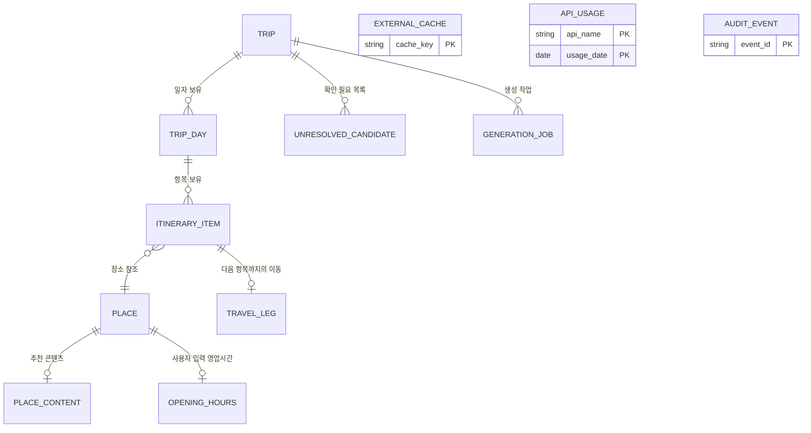

# Domain Entities — u1-trip-backend

**Stage**: 🟢 CONSTRUCTION - Functional Design (Unit 1/3)
**Created**: 2026-08-13T05:30:00Z
**결정 근거**: `construction/plans/u1-trip-backend-functional-design-plan.md` Q1~Q19 = 전부 A

> **기술 비종속**: 본 문서는 도메인 개념을 정의합니다. 실제 테이블 DDL·인덱스·ORM 매핑은 Code Generation 에서 확정합니다.
> 시간 저장은 **UTC**, 표시는 **KST(`Asia/Seoul`)** 입니다 (NFR-7).

---

## 1. 엔티티 관계도

`EXTERNAL_CACHE` · `API_USAGE` · `AUDIT_EVENT` 는 여행 도메인과 **관계를 갖지 않는 독립 엔티티**입니다. 여행이 삭제되어도 남습니다(감사 목적).

---

## 2. 핵심 엔티티

### 2.1 `Trip` — 여행 (애그리게이트 루트)

| 속성 | 타입 | 제약 | 설명 |
|---|---|---|---|
| `trip_id` | UUIDv4 | PK, 불변 | 추측 불가능한 식별자 (SEC-08) |
| `title` | string | 1~100자 | 여행 이름 |
| `destination` | string | 1~50자 | 목적지 지역명 (그라운딩 범위 판정에 사용) |
| `start_date` | date | 필수 | 시작일 |
| `end_date` | date | `>= start_date`, **기간 ≤ 10일** | 종료일 (Q18=A) |
| `party_size` | int | 1~20 | 동행 인원 |
| `style_tags` | list[string] | 0~8개 | 맛집/자연/역사/쇼핑/휴식/액티비티 등 |
| `day_start_time` | time | 기본 `09:00` | 하루 활동 시작 |
| `day_end_time` | time | `> day_start_time`, 기본 `21:00` | 하루 활동 종료 |
| `default_travel_mode` | TravelMode | 필수 | 주 이동수단 |
| `budget_level` | BudgetLevel? | 선택 | LOW / MEDIUM / HIGH |
| `share_token` | string(43)? | UNIQUE, nullable | 읽기 전용 공유 토큰 (`trip_id` 와 독립, DD-25) |
| `created_at` / `updated_at` | datetime(UTC) | 필수 | |

**불변식**
- `end_date - start_date + 1 <= 10` (Q18=A)
- 전 일자 항목 합계 `<= 100` (Q18=A)
- `share_token` 은 `trip_id` 로부터 도출되지 않는 독립 난수 (SEC-08)

### 2.2 `TripDay` — 일자

| 속성 | 타입 | 제약 | 설명 |
|---|---|---|---|
| `day_id` | UUIDv4 | PK | |
| `trip_id` | UUIDv4 | FK → Trip | |
| `day_index` | int | 1부터, `<= 여행 기간` | 1일차, 2일차 … |
| `date` | date | `start_date + (day_index-1)` | 파생값 |

**불변식**: `(trip_id, day_index)` 는 유일. 일자 삭제 시 뒤 일자의 `day_index` 를 재부여

### 2.3 `ItineraryItem` — 일정 항목

| 속성 | 타입 | 제약 | 설명 |
|---|---|---|---|
| `item_id` | UUIDv4 | PK | |
| `day_id` | UUIDv4 | FK → TripDay | |
| `place_id` | UUIDv4 | FK → Place | |
| `position` | int | 0부터 연속 | 일자 내 방문 순서 |
| `arrival_at` | datetime(UTC)? | 계산값 | C15 산출 |
| `departure_at` | datetime(UTC)? | 계산값 | `arrival_at + stay_minutes` |
| `stay_minutes` | int | `1 ~ 720` | 체류시간 (기본값 BR-52) |
| `time_fixed` | bool | 기본 `false` | true 면 `fixed_time` 유지 (Q7=A) |
| `fixed_time` | time? | `time_fixed=true` 일 때 필수 | 예약 등 고정 시각 |
| `travel_mode` | TravelMode? | null 이면 여행 기본값 | 다음 항목까지의 이동수단 |
| `memo` | string? | 0~500자 | 사용자 메모 |
| `warnings` | list[ItemWarning] | 계산값 | 경고 목록 (2.9) |

**불변식**
- `(day_id, position)` 은 유일하며 0부터 빈틈없이 연속
- `time_fixed=true` 이면 `fixed_time` 필수, `arrival_at` 의 KST 시각은 항상 `fixed_time` 과 일치 (BR-31)
- `departure_at > arrival_at` (`stay_minutes >= 1`)

### 2.4 `Place` — 장소

| 속성 | 타입 | 제약 | 설명 |
|---|---|---|---|
| `place_id` | UUIDv4 | PK | |
| `name` | string | 1~120자, **HTML 태그 제거됨** | 지역검색 `title` 정제값 (BR-14) |
| `road_address` | string? | | 도로명 주소 |
| `address` | string? | | 지번 주소 |
| `category_raw` | string? | | 지역검색 원본 분류 문자열 |
| `category` | PlaceCategory | 필수 | 정규화 분류 (2.10) |
| `phone` | string? | | 전화번호 |
| `latitude` | float | **33.0 ~ 39.0** | WGS84 (BR-15) |
| `longitude` | float | **124.0 ~ 132.0** | WGS84 (BR-15) |
| `naver_link` | string? | | 지역검색 `link` |
| `source` | PlaceSource | 필수 | `NAVER_LOCAL` / `USER_MANUAL` / `MOCK` |
| `resolved_from` | string? | | 그라운딩 시 원본 후보명 (추적성) |
| `match_score` | float? | 0.0~1.0 | 그라운딩 유사도 (BR-11) |

**불변식**
- 좌표는 국내 범위 안. 범위를 벗어나면 **저장 거부** (BR-15) — 좌표계 오해석을 조기에 드러내는 안전장치
- `name` 에 `<` `>` 문자가 남아 있으면 안 됨 (BR-14, SEC-05)

> ⚠️ **좌표계 주의**: 지역검색 `mapx`/`mapy` → WGS84 변환은 **단일 함수 `to_wgs84(mapx, mapy)` 에만** 존재합니다.
> 실제 좌표계는 Build & Test 에서 실응답으로 확정하며, 오해석 시 이 함수 한 곳만 수정합니다.

### 2.5 `OpeningHours` — 영업시간 (사용자 입력, Q10=A)

| 속성 | 타입 | 제약 | 설명 |
|---|---|---|---|
| `place_id` | UUIDv4 | PK, FK → Place | |
| `weekday_rules` | list[DayRule] | 0~7개 | 요일별 규칙 |
| `entered_by_user` | bool | 항상 `true` | **외부 API 에서 자동 수집하지 않음** |
| `updated_at` | datetime(UTC) | | |

`DayRule` = `{weekday: 0~6, open: time, close: time, closed: bool}`
- `close < open` 이면 자정 넘김으로 해석 (예: 18:00~02:00)
- `closed=true` 인 요일은 휴무

**🔴 중요**: 이 엔티티는 **레코드가 없는 것이 정상 상태**입니다. FR-13 경고는 레코드가 있을 때만 산출됩니다 (BR-35).

### 2.6 `TravelLeg` — 이동 구간

| 속성 | 타입 | 제약 | 설명 |
|---|---|---|---|
| `leg_id` | UUIDv4 | PK | |
| `from_item_id` | UUIDv4 | FK → ItineraryItem | |
| `to_item_id` | UUIDv4 | FK → ItineraryItem | |
| `mode` | TravelMode | 필수 | |
| `duration_sec` | int | `>= 0` | 소요시간 |
| `distance_m` | int | `>= 0` | 거리 |
| `path` | list[Coordinate]? | | 자동차 실경로 좌표열 (Directions 제공 시) |
| `is_estimate` | bool | 필수 | **근사치 여부** — 대중교통은 항상 `true` (BR-27) |
| `source` | LegSource | 필수 | `DIRECTIONS_API` / `HAVERSINE_WALK` / `HAVERSINE_TRANSIT` / `HAVERSINE_CAR_FALLBACK` |

**불변식**: `mode=TRANSIT` 이면 `is_estimate=true` 이고 `path` 는 항상 `null` (CON-1)

### 2.7 `UnresolvedCandidate` — 확인 필요 장소 (FR-3)

| 속성 | 타입 | 설명 |
|---|---|---|
| `candidate_id` | UUIDv4 | |
| `trip_id` | UUIDv4 | FK → Trip |
| `day_index` | int | LLM 이 배정했던 일자 |
| `raw_name` | string | LLM 이 제시한 장소명 |
| `category_hint` | string? | |
| `reason` | string | LLM 추천 사유 |
| `failure_code` | ResolveFailureCode | 실패 사유 (2.11) |
| `best_candidate_name` | string? | 가장 근접했던 검색 결과 (사용자 판단 보조) |
| `best_match_score` | float? | |

**🔴 이 엔티티가 환각 차단의 가시적 증거**입니다. 해석되지 않은 장소는 `ItineraryItem` 이 되지 못하고 여기에 남습니다 (BR-12).

### 2.8 `PlaceContent` — 추천 콘텐츠 (FR-20, FR-21)

| 속성 | 타입 | 제약 | 설명 |
|---|---|---|---|
| `place_id` | UUIDv4 | PK, FK → Place | |
| `highlights` | list[string] | **3~5개 또는 빈 목록** | 대표 메뉴 / 관람 포인트 |
| `is_ai_summary` | bool | 항상 `true` | UI 에 "AI 요약" 표기 (CON-7) |
| `sources` | list[BlogRef] | **`highlights` 가 비지 않으면 3건 이상** | 근거 블로그 (BR-40) |
| `images` | list[ImageRef] | 0~6개 | 썸네일 + 출처 |
| `generated_at` | datetime(UTC) | | |

`BlogRef` = `{title, link, blogger_name, post_date?}` / `ImageRef` = `{thumbnail_url, link, source_title}`

**불변식 (DD-24, BR-40)**: `len(sources) < 3` 이면 `highlights` 는 **반드시 빈 목록**. 근거 없는 요약은 존재할 수 없습니다.

### 2.9 `ItemWarning` — 항목 경고 (값 객체)

| 속성 | 타입 | 설명 |
|---|---|---|
| `type` | WarningType | 경고 종류 |
| `detail` | string | 사용자 노출 문구 |

`WarningType`
| 값 | 발생 조건 | 근거 |
|---|---|---|
| `OUTSIDE_OPENING_HOURS` | 영업시간 정보가 있고 도착 시각이 밖 | BR-35, FR-13 |
| `FIXED_TIME_CONFLICT` | 고정 시각 도착이 물리적으로 불가 | BR-32, Q7=A |
| `DAY_OVERFLOW` | 하루 종료 시각 초과 | BR-33, Q8=A |
| `ESTIMATED_TRAVEL_TIME` | 이동시간이 근사치 | BR-27, CON-1 |

**설계 원칙**: 경고는 **차단하지 않습니다.** 전부 표시만 하고 판단은 사용자에게 맡깁니다 (Q7=A, Q8=A).

---

## 3. 운영 엔티티

### 3.1 `GenerationJob` (Q5=A 비동기, C28)

| 속성 | 타입 | 설명 |
|---|---|---|
| `job_id` | UUIDv4 | PK |
| `trip_id` | UUIDv4 | FK → Trip |
| `state` | JobState | `queued` / `running` / `succeeded` / `partial` / `failed` |
| `step` | GenerationStep? | 현재 단계 |
| `progress` | float | 0.0 ~ 1.0 |
| `resolved_count` / `unresolved_count` | int | 그라운딩 결과 (BR-13) |
| `problem` | ProblemDetails? | 실패 시 |
| `created_at` / `updated_at` / `completed_at` | datetime(UTC) | |

**수명**: 완료 후 **24시간** 뒤 정리 (Q14=A, BR-56)

### 3.2 `ExternalCache` (C12, NFR-4)

| 속성 | 타입 | 설명 |
|---|---|---|
| `cache_key` | string | PK — 정규화 해시 (BR-48) |
| `namespace` | string | `local_search` / `directions` / `blog` / `image` / `geocode` |
| `payload` | text(JSON) | 원본 응답 |
| `created_at` / `expires_at` | datetime(UTC) | |

**TTL**: 지역검색 7일 / Directions 1일 / 블로그·이미지 3일 / Geocoding 30일
**정리**: 만료 후 **7일 유예** 뒤 삭제 (Q14=A, BR-57)
**비대상**: LLM 응답은 캐시하지 않음 (C12 명세)

### 3.3 `ApiUsage` (C29, FR-34)

| 속성 | 타입 | 설명 |
|---|---|---|
| `api_name` | ApiName | PK (복합) |
| `usage_date` | date(KST) | PK (복합) — **KST 기준 일자** |
| `call_count` | int | 호출 수 |
| `error_count` | int | 실패 수 |
| `daily_limit` | int? | 상한 (지역검색 25,000) |

### 3.4 `AuditEvent` (SEC-13, SEC-14)

| 속성 | 타입 | 설명 |
|---|---|---|
| `event_id` | UUIDv4 | PK |
| `occurred_at` | datetime(UTC) | |
| `event_type` | AuditEventType | |
| `correlation_id` | string | 요청 추적 |
| `subject_id` | string? | 대상 식별자 (trip_id 등) |
| `detail` | text(JSON) | **인증 정보·좌표 원문 미포함** (SEC-03) |

`AuditEventType`: `TRIP_CREATED` / `TRIP_UPDATED` / `TRIP_DELETED` / `SHARE_TOKEN_ISSUED` / `SHARE_TOKEN_REVOKED` / `RATE_LIMIT_EXCEEDED` / `QUOTA_EXHAUSTED` / `EXTERNAL_AUTH_FAILED` / `LLM_SCHEMA_REJECTED`

**🔴 추가 전용**: 이 엔티티에 대한 UPDATE·DELETE 연산을 정의하지 않습니다 (SEC-14).

---

## 4. 열거형

### 4.1 `TravelMode`
`WALK` / `CAR` / `TRANSIT`

### 4.2 `PlaceCategory` (Q19=A 기본 체류시간과 연결)

| 값 | 기본 체류시간 | 지역검색 `category` 매칭 키워드 |
|---|---|---|
| `RESTAURANT` | 60분 | 음식점, 한식, 중식, 일식, 양식 |
| `CAFE` | 40분 | 카페, 디저트, 베이커리 |
| `ATTRACTION` | 90분 | 관광,명소, 공원, 해변, 전망 |
| `MUSEUM` | 120분 | 박물관, 미술관, 전시 |
| `SHOPPING` | 90분 | 쇼핑, 시장, 백화점 |
| `ACCOMMODATION` | 30분 | 숙박, 호텔, 펜션, 게스트하우스 |
| `OTHER` | 60분 | (미분류 기본값) |

### 4.3 `JobState` / `GenerationStep`
`queued` / `running` / `succeeded` / `partial` / `failed`
`DRAFTING` / `RESOLVING` / `ROUTING` / `OPTIMIZING` / `SCHEDULING` / `SAVING`

### 4.4 `ResolveFailureCode` (Q1=A 판정 조건에 1:1 대응)

| 값 | 의미 |
|---|---|
| `NO_SEARCH_RESULT` | 지역검색 결과 0건 |
| `LOW_SIMILARITY` | 유사도 < 0.6 (조건 ①) |
| `OUT_OF_REGION` | 목적지 범위 밖 (조건 ②) |
| `CATEGORY_MISMATCH` | 카테고리 대분류 불일치 (조건 ③) |
| `INVALID_COORDINATE` | 좌표가 국내 범위 밖 (BR-15) |
| `SEARCH_UNAVAILABLE` | 지역검색 API 실패 |

### 4.5 `ErrorCode` (Q15=A — 6종 분류)

| 코드 | HTTP | 사용자 노출 문구 (고정) |
|---|---|---|
| `VALIDATION_ERROR` | 400 | "입력값을 확인해 주세요." |
| `NOT_FOUND` | 404 | "요청하신 정보를 찾을 수 없습니다." |
| `RATE_LIMITED` | 429 | "요청이 너무 많습니다. 잠시 후 다시 시도해 주세요." |
| `QUOTA_EXHAUSTED` | 429 | "오늘 사용 가능한 외부 서비스 호출량을 모두 사용했습니다." |
| `EXTERNAL_SERVICE_ERROR` | 502 | "외부 서비스에 일시적인 문제가 있습니다." |
| `INTERNAL_ERROR` | 500 | "일시적인 오류가 발생했습니다." |

**🔴 규칙 (SEC-09, BR-58)**: 위 문구 **외의 텍스트를 사용자에게 노출하지 않습니다.** 예외 메시지·스택트레이스·내부 경로는 `correlation_id` 와 함께 로그에만 기록합니다.

### 4.6 `ApiName`
`NAVER_LOCAL` / `NAVER_BLOG` / `NAVER_IMAGE` / `NCP_DIRECTIONS` / `NCP_GEOCODING` / `ANTHROPIC`

---

## 5. 값 객체

| 값 객체 | 정의 | 불변식 |
|---|---|---|
| `Coordinate` | `{lat, lng}` | 33.0≤lat≤39.0, 124.0≤lng≤132.0 (BR-15) |
| `DistanceMatrix` | `{(i, j, mode) → TravelLeg}` | 대각선(i=i)은 duration=0, distance=0 |
| `PlaceCandidate` | `{raw_name, category_hint, suggested_stay_minutes, reason, preferred_time_slot}` | **좌표·주소·전화 필드 없음** (Q4=A) |
| `OptimizeConstraints` | `{anchor_start?, anchor_end?, fixed_positions: set}` | anchor 는 해당 일자 항목이어야 함 |
| `TripSpec` | 여행 생성 입력 (Trip 의 사용자 입력 부분) | Trip 불변식과 동일 |

### `PlaceCandidate` 에 좌표가 없는 이유 (Q4=A, DD-12)

LLM 이 반환할 수 있는 필드를 **의도적으로 제한**했습니다. 주소·좌표·전화·영업시간·가격은 **타입 자체에 존재하지 않으므로** 실수로 수용하는 경로가 만들어지지 않습니다. 사실성이 중요한 값은 전부 네이버 지역검색에서만 옵니다.

---

## 6. 데이터 수명 정책 요약

| 데이터 | 정책 | 근거 |
|---|---|---|
| Trip 및 하위 전체 | **하드 삭제** + 감사 로그 기록 | Q12=A, BR-54 |
| `share_token` | 무기한, 수동 폐기. 여행 삭제 시 무효화 | Q13=A, BR-55 |
| `GenerationJob` | 완료 후 24시간 | Q14=A, BR-56 |
| `ExternalCache` | TTL 만료 + 7일 유예 | Q14=A, BR-57 |
| `ApiUsage` | 90일 보존 | SEC-14 |
| `AuditEvent` | **90일 보존, 추가 전용** | SEC-14, BR-59 |

**정리 실행 시점**: 애플리케이션 기동 시 1회 + 하루 1회 백그라운드 (BR-60)
