# Component Dependency — trip

**Stage**: 🔵 INCEPTION - Application Design
**Created**: 2026-08-13T04:35:00Z

---

## 1. 의존성 규칙 (Q12=A)

### 1.1 계층 순위

| 순위 | 계층 | 의존 가능 대상 |
|---|---|---|
| L4 | `api/` | L3, L1 |
| L3 | `services/` | L2, L1 |
| L2 | `clients/`, `storage/`, `domain/` | L1 (단, **`domain/` 은 L1 도 의존하지 않음**) |
| L1 | `core/` | 없음 |

### 1.2 절대 규칙

1. **`domain/` (C14~C20) 은 아무것도 import 하지 않습니다.** 표준 라이브러리와 자기 계층 내부만 허용합니다.
   → 근거: PBT-R2·R7 을 네트워크·설정·DB 없이 실행하기 위함 (Q10=A, Q22=A)
2. **역방향 import 금지.** `domain → services`, `services → api`, `clients → services` 는 존재해서는 안 됩니다.
3. **`clients/` 와 `storage/` 는 서로를 의존하지 않습니다.** 단 하나의 예외가 C12 `CachingClientDecorator` → C31 `CacheRepository` 인데, 이는 **인터페이스(Protocol)를 통한 주입**으로 처리해 구체 타입 의존을 만들지 않습니다 (DD-7).
4. **서비스 간 수평 호출은 C25 오케스트레이터를 통해서만.** 예외 2건은 하위 방향이라 허용: C27 → C22(요약), C24 → C17(근사).

---

## 2. 백엔드 의존성 그래프 (u1)

```mermaid
flowchart TD
    subgraph L4["L4 · api/"]
        C32["C32 ApiRouters"]
        C33["C33 ApiSchemas"]
    end

    subgraph L3["L3 · services/"]
        C25["C25 ItineraryGenerationService<br/>(오케스트레이터)"]
        C21["C21 TripService"]
        C22["C22 LlmDraftGenerator"]
        C23["C23 PlaceResolver 🔴"]
        C24["C24 TravelMatrixService"]
        C26["C26 PlaceSearchService"]
        C27["C27 RecommendationService"]
        C28["C28 JobService"]
        C29["C29 QuotaService"]
    end

    subgraph L2C["L2 · clients/"]
        C13["C13 ClientFactory"]
        C12["C12 CachingDecorator"]
        C6["C6 BaseHttpClient"]
        C7["C7 LocalSearchClient"]
        C8["C8 ContentSearchClient"]
        C9["C9 DirectionsClient"]
        C10["C10 GeocodingClient"]
        C11["C11 LlmClient"]
    end

    subgraph L2S["L2 · storage/"]
        C30["C30 Database"]
        C31["C31 Repositories"]
    end

    subgraph L2D["L2 · domain/ — 의존성 0"]
        C14["C14 DomainModels"]
        C15["C15 TimelineCalculator"]
        C16["C16 DistanceMatrix"]
        C17["C17 TravelTimeEstimator"]
        C18["C18 RouteOptimizer"]
        C19["C19 OpeningHoursChecker"]
        C20["C20 IcsBuilder"]
    end

    subgraph L1["L1 · core/"]
        C1["C1 Config"]
        C2["C2 LoggingSetup"]
        C3["C3 SecurityHeaders"]
        C4["C4 RateLimiter"]
        C5["C5 ErrorHandler"]
    end

    C32 --> C33
    C32 --> C21
    C32 --> C25
    C32 --> C26
    C32 --> C27
    C32 --> C28
    C32 --> C29
    C32 --> C20
    C32 --> C4
    C32 --> C5

    C25 --> C22
    C25 --> C23
    C25 --> C24
    C25 --> C18
    C25 --> C15
    C25 --> C21
    C25 --> C28

    C21 --> C31
    C21 --> C14
    C22 --> C11
    C22 --> C14
    C23 --> C7
    C23 --> C14
    C24 --> C9
    C24 --> C17
    C24 --> C16
    C26 --> C7
    C27 --> C8
    C27 --> C22
    C28 --> C31
    C29 --> C31

    C13 --> C1
    C13 --> C6
    C13 --> C12
    C13 --> C7
    C13 --> C8
    C13 --> C9
    C13 --> C10
    C13 --> C11
    C12 -.->|Protocol| C31
    C6 --> C29
    C6 --> C2

    C31 --> C30
    C30 --> C1

    C15 --> C16
    C15 --> C14
    C18 --> C16
    C18 --> C14
    C17 --> C14
    C16 --> C14
    C19 --> C14
    C20 --> C14

    C3 --> C1
    C4 --> C1
    C4 --> C29
    C5 --> C2

    style C23 fill:#FFCDD2,stroke:#B71C1C,stroke-width:3px,color:#000
    style C25 fill:#FFE0B2,stroke:#E65100,stroke-width:3px,color:#000
    style L2D fill:#C8E6C9,stroke:#2E7D32,stroke-width:3px,color:#000
    style L1 fill:#E1BEE7,stroke:#6A1B9A,stroke-width:2px,color:#000
    style L3 fill:#BBDEFB,stroke:#1565C0,stroke-width:2px,color:#000
    style L4 fill:#FFF9C4,stroke:#F57F17,stroke-width:2px,color:#000
    style L2C fill:#B2EBF2,stroke:#00838F,stroke-width:2px,color:#000
    style L2S fill:#D7CCC8,stroke:#4E342E,stroke-width:2px,color:#000

    linkStyle default stroke:#333,stroke-width:2px
```



> `C6 → C29`(쿼터 계측)와 `C4 → C29`(상한 확인)는 계층을 거스르는 것처럼 보이지만, **C29 는 계측 인터페이스로 주입**되므로 구체 의존이 아닙니다 (DD-8).

---

## 3. 의존성 매트릭스 (u1 — 요약)

행 = 호출자, 열 = 피호출자. `X` = 직접 의존, `P` = Protocol 주입

| | core | domain | clients | storage | services |
|---|---|---|---|---|---|
| **api** (C32,C33) | X | X (C20) | — | — | X |
| **services** (C21~C29) | X | X | P | X | X (C25만) |
| **clients** (C6~C13) | X | **X** ※ | X (내부) | P (C12) | P (C29 계측) |
| **storage** (C30,C31) | X | — | — | X (내부) | — |
| **domain** (C14~C20) | — | X (내부) | — | — | — |
| **core** (C1~C5) | X (내부) | — | — | — | P (C4→C29) |

**빈 칸이 곧 규칙입니다.** `domain` 행이 자기 계층 외 전부 비어 있는 것이 이 설계의 핵심 성질입니다.

> ※ **2026-08-13 Code Generation Step 9 에서 정정**: 최초 작성 시 `clients → domain` 을 "—"(의존 없음)으로
> 표기했으나, 실제로는 **의존이 필요하고 또 바람직합니다.**
> - 클라이언트 DTO(`SearchedPlace`, `CarRoute`)가 좌표를 다루려면 `domain.models.Coordinate` 가 필요합니다.
>   여기서 국내 범위 검증(BR-15)이 걸리므로, 잘못된 좌표가 시스템에 진입하는 것을 **가장 바깥에서** 막습니다.
> - `MockDirectionsClient` 가 `domain.estimator` 를 재사용해 근사 로직 중복을 피합니다.
>
> **방향은 여전히 단방향(L2 내부, clients → domain)이며 순환은 0건입니다.** `domain` 이 `clients` 를
> 참조하지 않는다는 핵심 규칙은 그대로이고, `test_domain_layer_has_no_app_imports` 가 이를 강제합니다.

---

## 4. 순환 의존성 검증

| 검사 대상 | 결과 |
|---|---|
| L1~L4 계층 간 역방향 참조 | **0건** — 매트릭스 좌하단 삼각이 비어 있음 |
| `domain/` 외부 참조 | **0건** |
| 서비스 간 상호 호출 | **0건** — C27→C22, C24→C17 은 단방향(하위) |
| `clients/` ↔ `storage/` | **0건** — C12→C31 은 Protocol 주입 |
| u2 내부(features ↔ shared) | **0건** — `features/` 는 `shared/` 를 참조, 역방향 금지 |
| u1 ↔ u2 ↔ u3 | **0건** — u1→u2→u3 단방향 (OpenAPI → 브리지 계약 → BASE_URL) |

✅ **순환 의존성 0건**

---

## 5. 통신 패턴

| 경계 | 패턴 | 이유 |
|---|---|---|
| 브라우저 ↔ 백엔드 (일반) | 동기 REST (JSON) | 단순 조회·편집. NFR-1 500ms 목표 |
| 브라우저 ↔ 백엔드 (AI 생성) | **비동기 job + 폴링** | 최대 60초 소요. 동기 시 타임아웃 위험 (Q5=A) |
| 백엔드 ↔ 외부 API | 동기 HTTPS + 재시도·타임아웃 | C6 이 정책 소유 (NFR-2, NFR-3) |
| 백엔드 ↔ SQLite | 요청 단위 세션 | C30 이 수명 관리 |
| 서비스 ↔ 도메인 | **함수 호출 (값 전달)** | I/O 없음. 이것이 PBT 가능성의 근거 |
| 웹 ↔ 안드로이드 | **WebMessage (오리진 제한)** | Q15=A, SEC-08 |
| 안드로이드 ↔ 네이버지도 앱 | Intent (`nmap://`) + 웹 폴백 | FR-23, FR-24 |

---

## 6. 데이터 흐름

### 6.1 AI 일정 생성 — 데이터 변환 체인

```
TripSpec (사용자 입력)
    |
    v  C22 LlmDraftGenerator
list[list[PlaceCandidate]]      <-- 좌표 없음. 신뢰할 수 없는 상태
    |
    v  C23 PlaceResolver  (네이버 지역검색 대조)     [최상위 위험 차단점]
ResolveResult {resolved: list[Place], unresolved: [...]}
    |                                    |
    |                                    +--> 사용자에게 "확인 필요"로 노출 (FR-3)
    v  C24 TravelMatrixService
DistanceMatrix                  <-- 구간별 duration/distance/path
    |
    v  C18 RouteOptimizer  (순수)
재배열된 list[ItineraryItem]
    |
    v  C15 TimelineCalculator  (순수)
시각이 채워진 list[ItineraryItem]
    |
    v  C21 TripService -> C31 TripRepository
Trip (영속화)
```

**신뢰 경계**: `PlaceCandidate` → `Place` 전이가 **신뢰할 수 없는 데이터에서 신뢰할 수 있는 데이터로 넘어가는 유일한 지점**입니다. 이 경계를 우회하는 경로가 생기면 CON-7 위반입니다.

### 6.2 지도 렌더링 데이터 흐름

```
+-------------+     GET /trips/{id}      +--------------+
|  W1 Api     | -----------------------> |  C32 Router  |
|  Client     | <----------------------- |              |
+-------------+     Trip (JSON)          +--------------+
       |
       v  W2 QueryClient (캐시 + IndexedDB persist)
+-------------+
|  Trip 상태  |
+-------------+
       |
       +-----------------------------+
       |                             |
       v                             v
+-------------+              +-------------+
| W8 Timeline |<-- W3 -----> | W5 MapView  |
|   View      |   UiStore    |             |
+-------------+  (선택 동기) +-------------+
                                    |
                                    v  선언적 props
                             +-------------+
                             | W4 NaverMap |
                             |   Adapter   |
                             +-------------+
                                    |
                                    v  명령형 SDK 호출
                             +-------------+
                             | Naver Maps  |
                             |     SDK     |
                             +-------------+
```

**W3 `UiStore` 가 W8 과 W5 사이의 유일한 연결점**입니다 (FR-19 양방향 하이라이트). 두 컴포넌트가 서로를 직접 참조하지 않습니다.

### 6.3 딥링크 흐름 (웹/앱 공통 경로 — Q8=A)

```
+------------------+
| W13 DeepLink     |  순수 함수: (place|route) -> {app, web}
|     Builder      |
+------------------+
         |
         v
+------------------+
| W14 NativeBridge |  isNative() ?
+------------------+
    |          |
   Yes         No
    |          |
    v          v
+--------+  +-------------------+
| A3     |  | window.open(web)  |
| Bridge |  +-------------------+
+--------+
    |
    v
+--------------+   앱 있음   +------------------+
| A4 Intent    | ----------> | 네이버지도 앱     |
|   Launcher   |             +------------------+
+--------------+
    |  앱 없음
    v
+-------------------+
| web URL 로 폴백    |
+-------------------+
```

**URL 생성 로직은 W13 한 곳에만 존재합니다.** 안드로이드는 URL 을 만들지 않고 받아서 실행만 합니다 — 로직 이중화 방지.

---

## 7. 유닛 간 의존과 개발 순서

```
+---------------------+
|  u1-trip-backend    |  OpenAPI 스키마 확정이 u2 를 해제
+---------------------+
           |
           |  openapi-typescript 로 TS 타입 생성 (Q7=A)
           v
+---------------------+
|  u2-trip-web        |  브리지 계약 확정이 u3 를 해제
+---------------------+
           |
           |  BridgeHandler 메시지 3종 + BASE_URL
           v
+---------------------+
|  u3-trip-android    |
+---------------------+
```

| 순서 | 유닛 | 선행 조건 | 병렬 가능 여부 |
|---|---|---|---|
| 1 | u1 | 없음 | — |
| 2 | u2 | u1 의 OpenAPI 스키마 | u1 완료 후 |
| 3 | u3 | u2 의 브리지 계약 + 호스팅 URL | u2 완료 후 |

**병렬화 여지**: u2 의 순수 컴포넌트(W13 `DeepLinkBuilder`, W16 `SharedUi`)와 u3 의 껍데기(A1·A2·A7)는 선행 조건이 약해 앞당길 수 있습니다. 다만 Code Generation 은 유닛 단위로 진행하므로 실제 이득은 제한적입니다.

---

## 8. 결합도 관리 요약

| 잠재 결합 위험 | 완화 장치 |
|---|---|
| 서비스가 외부 API 구체 타입에 묶임 | Protocol 추상화 + C13 주입 (Q2=A) |
| 목 모드 분기가 코드 전역에 퍼짐 | C13 주입 시점에만 분기 (Q3=A) |
| 캐시 정책이 서비스에 침투 | C12 데코레이터 (Q11=A) |
| 계산 로직이 I/O 와 얽혀 테스트 불가 | `domain/` 의존성 0 규칙 (Q10=A, Q12=A) |
| 지도 SDK 명령형 API 가 React 전역에 누출 | W4 어댑터 (Q14=A) |
| 백엔드 스키마 변경이 프론트에 조용히 전파 | OpenAPI → TS 타입 생성 (Q7=A) |
| 딥링크 규칙이 웹·앱에 이중 구현 | W13 단일 소유 (Q8=A) |
| 안드로이드 브리지가 임의 페이지에 노출 | 오리진 허용목록 (Q15=A) |
