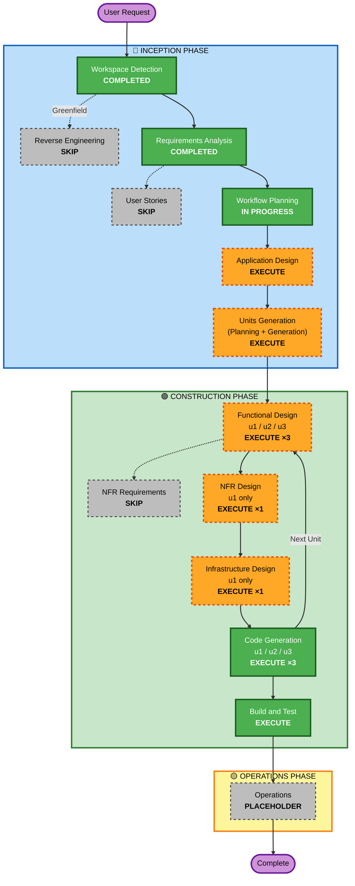

# Execution Plan — trip

**Stage**: 🔵 INCEPTION - Workflow Planning
**Created**: 2026-08-13T04:05:00Z
**Prior context loaded**: `inception/requirements/requirements.md` (FR 34 / NFR 15 / SEC 15 / PBT-R 8 / CON 8 / OUT 10 / SC 10), `requirement-verification-questions.md` (답변 25건), `aidlc-state.md`
**Status**: 승인 대기

---

## 1. Detailed Analysis Summary

### 1.1 Transformation Scope
**N/A — Greenfield.** 변환할 기존 시스템이 없습니다. 신규 3계층 시스템을 처음부터 구축합니다.

### 1.2 Change Impact Assessment

| 영역 | 해당 | 내용 |
|---|---|---|
| **User-facing changes** | ✅ Yes | 전체가 신규 사용자 인터페이스 — 일정 생성 마법사, 드래그 편집 타임라인, 지도 뷰, 장소 상세 패널, 안드로이드 앱 |
| **Structural changes** | ✅ Yes | 신규 3계층 아키텍처: FastAPI 백엔드 ← React 웹 ← Kotlin WebView 앱. 외부 시스템 4종 통합 |
| **Data model changes** | ✅ Yes | 신규 스키마 — Trip / Day / ItineraryItem / Place / TravelLeg / PlaceContent / ApiUsage / ExternalCache |
| **API changes** | ✅ Yes | 신규 REST API 전체 — 여행 CRUD, AI 생성, 장소 검색, 경로 계산, 순서 최적화, 추천 콘텐츠, 공유, `.ics` 내보내기 |
| **NFR impact** | ✅ Yes | 성능(NFR-1·12), 보안(SEC-01~15 **blocking**), 외부 쿼터 관리(NFR-4), 오프라인(FR-31·32), 접근성(NFR-6) |

### 1.3 외부 시스템 통합 지점 (신규 위험 요소)

| 외부 시스템 | 용도 | 실패 시 영향 | 완화 |
|---|---|---|---|
| NCP Maps — Web Dynamic Map | 지도 렌더링 | 지도 화면 불가 | 목 모드 배너 + 타임라인은 정상 (FR-33) |
| NCP Maps — Directions 5 | 자동차 경로·소요시간 | 이동시간 부정확 | 하버사인 근사 폴백 (FR-10) |
| 네이버 검색 API — 지역 | 장소 그라운딩 | **AI 일정 생성 자체가 불가** ⚠️ | 목 데이터 모드 (FR-33) — 최대 위험 지점 |
| 네이버 검색 API — 블로그/이미지 | 추천 콘텐츠·사진 | 추천 품질 저하 | 해당 섹션만 degrade (NFR-3) |
| Anthropic Claude API | 일정 초안·요약 | 자동 생성 불가 | 수동 편집 경로는 유지 (ASM-3) |
| 네이버지도 앱 (`nmap://`) | 실제 대중교통 길찾기 | 딥링크 실패 | `map.naver.com` 웹 폴백 (FR-24) |

### 1.4 Risk Assessment

| 항목 | 판정 | 근거 |
|---|---|---|
| **Risk Level** | **Medium-High** | 외부 API 4종 의존 + LLM 비결정성 + 안드로이드 실측 검증 불가(CON-6) + 보안 확장 blocking |
| **Rollback Complexity** | **Easy** | Greenfield, 로컬 배포, 기존 시스템 영향 없음. 볼륨 삭제로 완전 초기화 가능 |
| **Testing Complexity** | **Moderate-Complex** | 외부 API 전량 목킹 필요 + PBT(최적화·타임라인 불변식) + 안드로이드는 코드 리뷰 수준만 가능 |

**최상위 위험 3건**:
1. 🔴 **LLM 환각 장소** — FR-3 그라운딩이 무력화되면 존재하지 않는 장소가 일정에 들어감 → Functional Design 에서 그라운딩 판정 기준을 비즈니스 규칙으로 명문화
2. 🟠 **외부 쿼터 소진** — 인증 없는 공개 엔드포인트 + 유료 LLM (CA-5) → NFR Design 에서 레이트 리밋·일일 상한 설계 필수
3. 🟠 **안드로이드 미검증** — CON-6/ASM-4 → Code Generation 산출물의 신뢰도 한계를 Build & Test 에서 명시적으로 보고

---

## 2. Units of Work 결정

시스템은 **서로 다른 언어·빌드 시스템·배포 산출물**을 갖는 3개 단위로 분해됩니다. 단일 유닛으로 묶으면 설계·코드 생성 산출물이 과대해지고 언어별 규칙(PBT 프레임워크 등)이 혼재합니다.

| Unit | 이름 | 언어/빌드 | 책임 | 의존 |
|---|---|---|---|---|
| **u1** | `u1-trip-backend` | Python / uv·pip + Docker | REST API, SQLite 영속화, 외부 API 클라이언트 4종, AI 일정 생성 + 그라운딩, 타임라인 계산, 순서 최적화, `.ics`, 공유 토큰, 보안 미들웨어, 캐시·쿼터 | — |
| **u2** | `u2-trip-web` | TypeScript / npm + Vite | 지도 렌더링·마커·폴리라인, 타임라인 드래그 편집 UI, 장소 상세 패널, 딥링크 URL 생성, IndexedDB 오프라인 캐시, 반응형·접근성 | u1 (API 계약) |
| **u3** | `u3-trip-android` | Kotlin / Gradle | WebView 래퍼, JS↔네이티브 브리지(인텐트·공유·위치), 뒤로가기, 오프라인 화면, `BuildConfig.BASE_URL` | u2 (호스팅 URL) |

**업데이트 전략**: **Sequential** — u1 → u2 → u3.
**Critical path**: u1 의 API 계약이 u2 를 막고, u2 의 URL 이 u3 를 막습니다.
**Coordination points**: OpenAPI 스키마(u1↔u2), JS 브리지 인터페이스 규약(u2↔u3), 공유 환경변수(`BIND_HOST`/`BASE_URL`).

---

## 3. Workflow Visualization

---

## 4. Phases to Execute

### 🔵 INCEPTION PHASE

- [x] **Workspace Detection** — COMPLETED (2026-08-13)
- [x] **Reverse Engineering** — **SKIPPED**
  - **Rationale**: Greenfield. `trip/` 에 분석할 기존 코드가 0건입니다.
- [x] **Requirements Analysis** — COMPLETED / APPROVED (2026-08-13)
- [x] **User Stories** — **SKIP**
  - **Rationale**: Q16=A 로 사용자 계정이 없어 **페르소나가 단일**("개인 국내 여행 계획자")합니다. FR 34건이 이미 수용 기준 수준으로 구체화되어 있고, 화면 흐름은 FR-1~FR-32 에 순서대로 기술되어 있어 스토리 분해가 추가 정보를 만들어내지 못합니다. **팀 협업이 아닌 단독 개발**이라는 점도 근거입니다.
  - ⚠️ 원하시면 승인 시 포함 요청 가능합니다.
- [x] **Workflow Planning** — IN PROGRESS (본 문서)
- [ ] **Application Design** — **EXECUTE**
  - **Rationale**: 신규 컴포넌트가 전면적으로 필요합니다. 외부 API 클라이언트 4종, 일정 생성 오케스트레이션, 그라운딩, 타임라인 계산기, 순서 최적화기, 캐시·쿼터 관리자, 보안 미들웨어, 지도·타임라인 UI 컴포넌트, 안드로이드 브리지 — 이들의 책임 경계와 의존 방향을 코드 생성 전에 확정하지 않으면 순환 의존과 중복 구현이 발생합니다.
  - **산출물**: `inception/application-design/` — `components.md`, `component-methods.md`, `services.md`, `component-dependency.md`, `application-design.md`
- [ ] **Units Generation** — **EXECUTE**
  - **Rationale**: §2 대로 **언어·빌드 시스템·배포 산출물이 서로 다른 3개 단위**로 분해됩니다(Python/TypeScript/Kotlin). 신규 데이터 모델·신규 API 엔드포인트·복잡한 알고리즘(순서 최적화)·상태 관리(오프라인 캐시)가 모두 해당하며, PBT 프레임워크도 언어별로 달라(Hypothesis / fast-check) 유닛 분리가 필수입니다.
  - **산출물**: `inception/units/` — `units.md`, `unit-dependencies.md`

### 🟢 CONSTRUCTION PHASE

- [ ] **Functional Design** — **EXECUTE ×3** (u1, u2, u3)
  - **Rationale**: 비즈니스 규칙이 무겁습니다 — LLM 응답 스키마 검증과 **그라운딩 성공/실패 판정 기준**(위험 1건), 타임라인 시각 전파 규칙, 고정 시각 항목 제약, 순서 최적화 목적함수와 제약, 이동수단별 소요시간 산출식, 영업시간 경고 조건, 캐시 무효화 정책, 공유 토큰 수명. 기술 비종속 설계 없이 코드로 직행하면 이 규칙들이 코드 곳곳에 흩어집니다.
  - **PBT-01(advisory)** 에 따라 각 유닛 설계에 "Testable Properties" 절을 포함합니다.
- [ ] **NFR Requirements** — **SKIP** (전 유닛)
  - **Rationale**: 기술 스택(백엔드·프론트·안드로이드·DB·테스트 프레임워크)과 NFR 15건, SEC 15건, PBT 프레임워크 선정(PBT-09 → Hypothesis / fast-check)이 **Requirements Analysis 에서 이미 확정**되어 `aidlc-state.md` 의 Technology Stack 표에 기록되었습니다. 이 스테이지가 새로 결정할 것이 없습니다.
- [ ] **NFR Design** — **EXECUTE ×1** (u1 only)
  - **Rationale**: Security Baseline 이 **blocking** 이고 통제의 대부분이 백엔드에 위치합니다 — 보안 헤더 미들웨어(SEC-04), 입력 검증 계층(SEC-05), IDOR 방지 식별자·공유 토큰(SEC-08), 레이트 리밋·일일 상한(SEC-11, 위험 2건), 자격증명 격리(SEC-12), 감사 로그·90일 로테이션(SEC-14), 전역 예외 핸들러(SEC-15). 이들을 논리 컴포넌트에 매핑하는 단계가 필요합니다.
  - **u2·u3 는 SKIP**: 프론트엔드 CSP 소비·SRI, 안드로이드 WebView 하드닝(`javaScriptEnabled` 범위, 파일 접근 차단, 브리지 노출 최소화)은 각 유닛 Functional Design 에 포함시키는 편이 산출물 분산을 막습니다.
- [ ] **Infrastructure Design** — **EXECUTE ×1** (u1 only)
  - **Rationale**: Docker Compose 구성, 볼륨(SQLite·로그), 포트 `8200`, **`BIND_HOST` 전환 설계(CA-1 해소의 핵심)**, 환경변수 목록, 헬스체크, 비루트 실행, 이미지 다이제스트 고정(SEC-10), 기존 프로젝트(8000/5173/8100)와의 격리 확인이 필요합니다.
  - **u2 는 u1 의 Compose 에 정적 자산으로 포함**, **u3 는 Gradle 빌드 구성**이라 별도 인프라 설계가 성립하지 않습니다 → SKIP.
- [ ] **Code Generation** — **EXECUTE ×3** (ALWAYS, per-unit)
  - **Rationale**: 규칙상 항상 실행. 유닛별로 Part 1(계획) → Part 2(생성) 수행.
- [ ] **Build and Test** — **EXECUTE** (ALWAYS)
  - **Rationale**: 규칙상 항상 실행. u1·u2 는 **실측 검증**, u3 는 **정적 검토만**(CON-6/ASM-4 — 이 한계를 보고서에 명시).

### 🟡 OPERATIONS PHASE

- [ ] **Operations** — PLACEHOLDER
  - **Rationale**: 향후 배포·모니터링 워크플로용 자리표시자. 운영 문서 색인과 미해결 결정 사항 정리만 수행.

---

## 5. 스테이지 집계

| 구분 | 개수 | 목록 |
|---|---|---|
| **완료** | 3 | Workspace Detection, Reverse Engineering(SKIP), Requirements Analysis |
| **실행 예정** | 11 | Workflow Planning, Application Design, Units Generation, Functional Design ×3, NFR Design ×1, Infrastructure Design ×1, Code Generation ×3 → +Build and Test, Operations |
| **SKIP 예정** | 3 | User Stories, NFR Requirements(전 유닛), NFR Design·Infrastructure Design 의 u2·u3 분 |

**정확한 실행 스테이지 수**: Workflow Planning(1) + Application Design(1) + Units Generation(1) + Functional Design(3) + NFR Design(1) + Infrastructure Design(1) + Code Generation(3) + Build and Test(1) + Operations(1) = **13개 실행**
**승인 게이트 수**: 약 **12회** (Workspace Detection·Operations 제외)

---

## 6. Estimated Timeline

| 스테이지 | 대략적 소요 |
|---|---|
| Application Design | 1 세션 |
| Units Generation | 0.5 세션 |
| Functional Design ×3 | 2 세션 |
| NFR Design + Infrastructure Design | 1 세션 |
| Code Generation ×3 | 3~4 세션 (u1 가장 큼) |
| Build and Test | 1~2 세션 (결함 수정 포함) |
| Operations | 0.5 세션 |
| **합계** | **약 9~11 작업 세션** |

각 스테이지 종료 시 승인 게이트에서 멈추므로, 원하시는 시점에 중단·재개할 수 있습니다.

---

## 7. Success Criteria

**Primary Goal**: 국내 여행 일정을 AI가 생성하고, 시간표·이동경로·장소 추천을 네이버지도 위에서 확인하며, 실제 길찾기는 네이버지도 앱으로 위임하는 웹앱 + 안드로이드 앱을 동작하는 상태로 인도한다.

**Key Deliverables**:
1. `trip/backend/` — FastAPI 애플리케이션 + SQLite + 외부 API 클라이언트 4종 + 테스트
2. `trip/web/` — React + TypeScript 프론트엔드 + 지도·타임라인 + 테스트
3. `trip/android/` — Kotlin WebView 프로젝트 (Gradle, 빌드 가능한 완전 형태)
4. `trip/docker-compose.yml`, `Dockerfile`, `.env.example` — 단일 명령 기동
5. `trip/aidlc-docs/` — 전 스테이지 설계 문서 및 감사 추적
6. 빌드·테스트·안드로이드 빌드 안내서

**Quality Gates**:

| ID | 게이트 | 검증 |
|---|---|---|
| **QG-1** | SC-1~SC-10 (requirements.md §12) 충족 | Build and Test |
| **QG-2** | 단위 테스트 + PBT **전부 통과, 네트워크 비의존** | Build and Test |
| **QG-3** | **Security Compliance: blocking finding 0건** (SEC-01~15) | 전 스테이지 |
| **QG-4** | **PBT Compliance: blocking finding 0건** (PBT-02·03·07·08·09) | 전 스테이지 |
| **QG-5** | FR 34 / NFR 15 / SEC 15 / PBT-R 8 **미매핑 0건** (추적성) | Code Generation |
| **QG-6** | 애플리케이션 코드가 `aidlc-docs/` **밖에만** 존재 | Code Generation |
| **QG-7** | 인증 정보 없이 기동해도 목 데이터 모드로 전 화면 동작 (FR-33) | Build and Test |
| **QG-8** | Docker Compose 단일 명령 기동 + 기존 프로젝트와 포트 충돌 0건 | Build and Test |

**⚠️ 검증 한계 (사전 고지)**: u3(안드로이드)는 로컬 JDK·Android SDK 부재로 **컴파일·APK 빌드·기기 실행을 검증할 수 없습니다**(CON-6, ASM-4). QG-1~QG-8 중 u3 관련 항목은 **정적 검토 판정**으로 표기하며 Build and Test 보고서에 명시합니다.

---

## 8. Extension Enforcement (전 스테이지 적용)

| Extension | Mode | 각 스테이지에서 해야 할 것 |
|---|---|---|
| **Security Baseline** | **Blocking** | 스테이지 완료 메시지에 "Security Compliance" 절 필수. SEC-01~15 각각 준수/미준수/N-A 판정. 미준수 시 **다음 스테이지 진행 차단** |
| **Property-Based Testing** | **Partial** | "PBT Compliance" 절 필수. PBT-02·03·07·08·09 는 blocking, 나머지는 advisory. 적용 스테이지: Functional Design(PBT-01), Code Generation(전체), Build and Test(PBT-08) |
| Resiliency Baseline | 비활성 | 강제 없음. 각 스테이지 완료 시 "확장 없음(사용자 opt-out)" 표기 |
